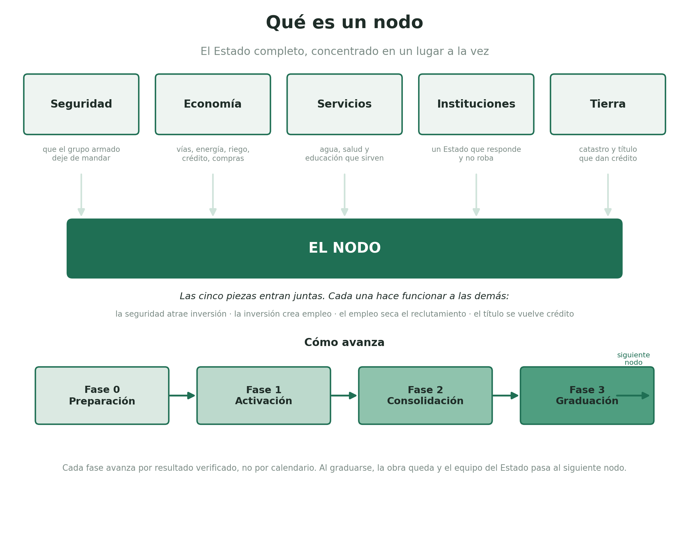
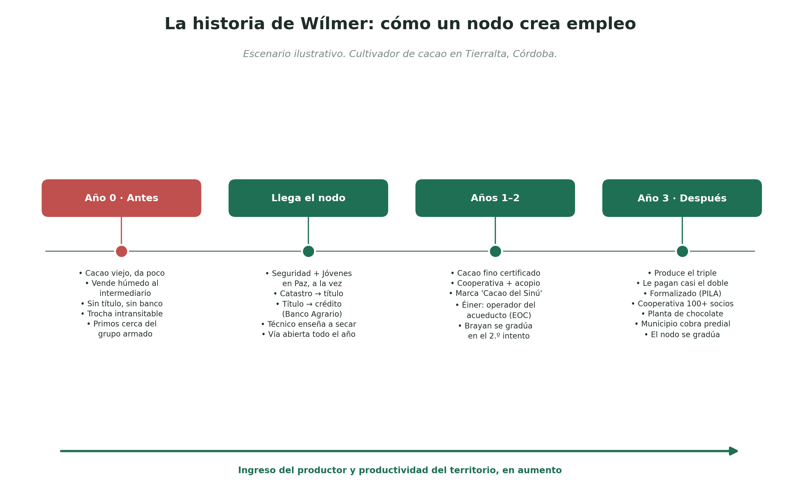

> **MIXTO.** El *principio* de esta sección es núcleo (no se vota); sus *parámetros* (cifras, umbrales, criterios) son ejecución y se discuten con evidencia. Ver [CONTRIBUTING](../CONTRIBUTING.md).

# 3. La Columna Vertebral: Estado en el Territorio

## 3.0 Qué es un nodo, en lenguaje claro

Un nodo es un municipio donde el Estado llega completo y al mismo tiempo, en vez de llegar a pedazos y en años distintos.

Hoy el Estado colombiano llega a la periferia en fragmentos que nunca se encuentran. La vía se construye un año, la escuela otro, el puesto de salud se inaugura sin médico, la seguridad no llega nunca o llega sola, sin nada detrás. Cada pieza, suelta, no alcanza para cambiar la vida de nadie: la carretera no sirve si no hay qué transportar, el título de tierra no sirve sin crédito ni asistencia técnica, la seguridad no se sostiene si el joven no tiene un empleo al cual irse. El resultado es un Estado caro que se siente ausente, porque ninguna de sus partes llega a masa crítica.

El nodo invierte esa lógica. En lugar de repartir un poco de todo por todas partes, concentra todo lo que un territorio necesita en un mismo lugar y al mismo tiempo, hasta que ese lugar cambie de verdad. Después pasa al siguiente. Es la diferencia entre echarle una gota de agua a cien plantas y regar bien unas pocas hasta que den fruto.

### Qué trae un nodo

Cinco cosas que entran juntas, no por separado:

- **Seguridad**, para que el grupo armado deje de mandar, extorsionar y reclutar.
- **Economía**, con vías, energía, riego, conectividad, crédito y compras del Estado que crean demanda real.
- **Servicios**, con agua, salud y educación que funcionan, no que existen solo en el papel.
- **Instituciones**, con un Estado que responde, contrata sin robar y resuelve conflictos.
- **Tierra**, con catastro y titulación que vuelven al campesino dueño y sujeto de crédito.

La razón de que entren juntas es el corazón del modelo: cada una hace funcionar a las demás. La seguridad permite que llegue la inversión. La inversión crea empleo formal. El empleo formal le quita reclutas al grupo armado. El título de tierra se vuelve garantía para un crédito. El crédito financia la producción que la vía nueva puede sacar al mercado. Por separado, cada pieza fracasa, como ha fracasado durante décadas. Juntas, se sostienen unas a otras.

### Cómo funciona

Un nodo no es permanente. Avanza por fases y se gradúa. Primero entra la seguridad y la presencia básica del Estado (tropa, juez, médico y maestro llegan en semanas, no en años). Luego se activan la economía y los servicios. Cuando el empleo formal se sostiene y el municipio empieza a sostenerse solo, el nodo se gradúa: la inversión y la infraestructura quedan, el equipo del Estado se recicla hacia el siguiente municipio. No se abandona el lugar, se vuelve autosuficiente.

Y aquí está la regla que protege al modelo de la politiquería: **la expansión la dispara el resultado, no el calendario ni el favor político**. No se abre un nodo nuevo porque toca o porque conviene a alguien, sino cuando el anterior demuestra, con datos públicos y verificables, que funcionó. El gobierno que no saca adelante los primeros nodos no puede abrir los siguientes.

### Qué NO es un nodo

No es una zona especial con reglas distintas ni un enclave privilegiado para siempre. No es repartir parejo un presupuesto entre todos los municipios, que es justo lo que no funciona. Y no es abandonar al resto del país: mientras los nodos concentran la inversión productiva nueva, hay un piso de derechos y servicios que llega a todos por igual (ver el Piso Universal, 3.5). El nodo es donde el Estado invierte para producir; el piso universal es donde el Estado cumple para todos.

> En una frase: un nodo es el Estado completo, concentrado en un lugar a la vez, que se queda hasta que el lugar cambie y solo entonces avanza al siguiente. Es la apuesta a que el Estado deje de llegar tarde, incompleto y en pedazos.

## 3.0.1 Un nodo visto desde adentro: la historia de Wílmer

*Escenario ilustrativo. Wílmer y sus primos son inventados; sirven para mostrar cómo encajan las piezas, no para prometer que a cada quien le irá así. Pero los componentes de la historia son reales: el cacao fino de Córdoba, el título que se vuelve crédito, las empresas operadoras comunitarias de agua y el programa Jóvenes en Paz existen y ya operan. El nodo es la apuesta a juntar, en una misma persona y un mismo pueblo, todas esas piezas que hoy llegan sueltas.*

### El año cero, antes

Es un martes de mayo en una vereda a hora y media del casco urbano de Tierralta, en el sur de Córdoba. Wílmer tiene veintidós años y una moto prestada. Con su papá cultiva dos hectáreas de cacao que da regular, porque la mata está vieja y nadie le enseñó a podarla ni a injertarla. La cosecha la vende húmeda, en la misma vereda, al único comprador que sube hasta allá: un intermediario que pone el precio porque sabe que Wílmer no tiene cómo bajar el grano por su cuenta. La trocha se vuelve un barrizal cuando llueve, y en esa zona llueve casi todo el año. Buena parte de lo que cosecha se queda o se pudre antes de llegar al pueblo.

Wílmer no tiene cuenta de banco. La tierra que trabaja su familia es suya "de toda la vida", pero no hay un papel que lo diga, así que ningún banco le presta. En el pueblo casi no hay en qué trabajar. Y siempre está la otra oferta, la de la gente que controla la zona, que les ofrece plata ya a los muchachos como él. Dos de sus primos ya dijeron que sí. Éiner, el de diecinueve, entró hace ocho meses. Brayan, el menor, anda rondando.

Esa es la foto del Estado ausente. No falta una cosa, faltan todas a la vez, y por eso las pocas que a veces llegan no sirven de nada. Si le regalaran mejores matas, no podría sacar el grano. Si le pavimentaran la vía, no tendría con qué producir más. Si le dieran el título, ningún banco confiaría todavía. Cada pieza, suelta, se cae.

### Llega el nodo, y llega completo

Tierralta entra como nodo. Lo que cambia no es una cosa, es que llegan todas y empiezan a empujarse entre sí.

Primero la zona se calma. La fuerza pública entra en serio y se queda, y al mismo tiempo, no después, llega Jóvenes en Paz, el programa que les pone a los muchachos en riesgo una alternativa real. Funciona con tres piezas que van juntas. La primera es un ingreso desde el primer día: una transferencia mensual condicionada a que el joven asista a la formación, no reincida y cumpla horas de servicio a su comunidad. Eso le compite de frente a la oferta del grupo armado, plata por plata, solo que esta no le exige un arma. La segunda es formación que termina en una certificación del SENA en un oficio que el propio nodo va a necesitar. La tercera es el puente al empleo de verdad, para que el muchacho no termine certificado y frustrado sin trabajo.

Éiner, el primo que ya había entrado, alcanza a salirse y se inscribe. Brayan, el menor, entra al programa antes de cruzar la línea. A Wílmer, que nunca se vinculó pero vivía calculando, por primera vez la cuenta le da distinto.

Llegan las brigadas del catastro. Miden, levantan linderos, y unos meses después Wílmer tiene algo que su papá nunca tuvo: un título a su nombre. Un papel. Parece poco. No lo es. Con ese título entra al Banco Agrario y sale con el primer crédito de su vida, garantizado con su propia tierra. Renueva el cacao con clones finos de aroma, los que pagan sobreprecio afuera. Y un técnico agropecuario, de los que el nodo puso en el territorio, le enseña a podar, a injertar, a fermentar en cajón y a secar el grano. Wílmer deja de vender cacao húmedo y baboso. Empieza a entregar grano fermentado y seco, que vale bastante más.

Mientras tanto arreglan la vía terciaria, y ahora el camión sube todo el año. Al pueblo llega un centro de acopio con secadoras, montado por una cooperativa a la que Wílmer se asocia con otros cuarenta cultivadores. Juntos compran insumos por volumen, más barato. Juntos negocian el precio, ya no uno por uno frente al intermediario que mandaba. Juntos certifican origen, y una marca, "Cacao del Sinú", empieza a aparecer en catálogos de exportación que gestiona ProColombia.

### Lo que pasó con los primos

Éiner se certifica en operación y mantenimiento de sistemas de agua. Durante seis meses, mientras se forma, trabaja en la obra del acueducto veredal por el puente de ingreso del nodo, y le pagan por construir el agua de su propia vereda. Al graduarse, la Empresa Operadora Comunitaria que va a manejar ese acueducto los próximos diez años lo contrata de planta, con contrato y seguridad social, porque necesita justo ese oficio y porque un incentivo le abarata contratar a un joven certificado del programa. Éiner salió del ciclo no porque alguien lo convenciera, sino porque apareció un camino mejor que el que tenía.

Con Brayan no todo sale redondo. Cumple unos meses, se cansa de la disciplina, falta a la formación y la transferencia se le suspende, porque es condicionada y la condición se verifica. Lo intenta de nuevo medio año después. La segunda vez termina la certificación. La honestidad de esta historia está ahí: el programa no salva a todos al primer intento, y a algunos no los alcanza. Apunta a los que están en el borde, a los que todavía calculan. A Brayan lo recuperó la segunda vez. A otros no los va a recuperar, y el plan no promete lo contrario.

### El año tres, después

Wílmer tiene veinticinco años. Sus dos hectáreas producen el triple y le pagan casi el doble por kilo, porque ahora vende grano fino, seco y certificado. Tiene cuenta, historial de crédito, y acaba de sacar el segundo préstamo para comprarle la tierra al vecino que se va. Cotiza a salud y pensión. Eso, que suena a trámite, significa que por primera vez aparece en las cuentas del país como lo que siempre fue: un trabajador.

La cooperativa, que empezó con cuarenta, ya pasa de cien asociados y emplea de planta a varias personas en el acopio. El camionero que sube el grano tiene trabajo todo el año. Llegó un comprador que monta una pequeña planta de chocolate fino, porque ahora hay materia prima constante y de calidad. Cada peso de cacao que entra a Tierralta da vueltas adentro: paga el almuerzo, la moto nueva, el cuaderno del niño, el albañil que arregla la casa. Y el municipio, que antes vivía de transferencias, empieza a recaudar predial sobre una tierra que ahora sí está en el catastro y sí produce. Con eso arregla la segunda vía. El nodo empieza a pagarse a sí mismo.

Cuando el empleo formal se sostiene y el pueblo camina solo, el equipo del Estado recoge y se va al siguiente municipio. No se lleva nada de lo que dejó. La vía queda. El catastro queda. La cooperativa, la marca, el banco que ya conoce a Wílmer, el acueducto que opera Éiner, la planta de chocolate, todo eso queda y sigue creciendo sin que nadie lo empuje desde afuera. Eso es graduarse.

El empleo en un nodo no apareció porque alguien lo decretó. Apareció porque, por primera vez, todas las condiciones para que existiera estuvieron presentes al mismo tiempo y en el mismo lugar: había con qué producir, cómo sacarlo, a quién venderlo, con qué financiarlo, y la seguridad para que valiera la pena intentarlo. El empleo fue la consecuencia natural de que el Estado, por una vez, llegara completo.

## 3.1 Fases de despliegue por nodo

| Fase | Nombre | Acciones concretas | Activador para siguiente fase |
|---|---|---|---|
| 0 | Preparación | Seguridad + presencia institucional + catastro multipropósito + piso básico universal | Catastro >80% del municipio; homicidios en descenso sostenido 6 meses |
| 1 | Activación | Conectividad ancla + capacitación + garantías de crédito + ventanilla única + compras públicas como demanda ancla | >200 empleos formales netos en PILA; al menos 1 empresa ancla operando |
| 2 | Consolidación | Inversión privada atraída, cooperativas formadas, medición de empleo persistente | Empleo formal sostenido 12 meses; predial cubriendo >50% gasto municipal básico |
| 3 | Graduación | Baja intensidad estatal; recursos reciclados al siguiente nodo | Indicadores Fase 2 sostenidos 24 meses; siguiente nodo en Fase 0 activo |

## 3.2 Nodos Ola 1: Criterio técnico, no clientelista

Tres nodos seleccionados por seguridad ya en tendencia descendente, potencial productivo real, capacidad institucional mínima y representación geográfica.

| Nodo | Región | Vector principal | Por qué ahora |
|---|---|---|---|
| Montería + Tierralta/Valencia | Córdoba, Caribe | Agroindustria ganadera + solar + turismo Sinú | −63% homicidios 2025. Informalidad 91.2%. Plan Córdoba 2052 con respaldo CAF. |
| Florencia + norte de Caquetá | Caquetá, Amazonía | Cacao premium + ganadería sostenible | −46% homicidios 2025. Zona históricamente cocalera: si funciona aquí, el argumento de replicabilidad es imbatible. |
| Valledupar + sur del Cesar | Cesar, Caribe | Café + cacao premium + energía solar | −14% homicidios 2025. Parque solar La Loma operativo. Catastro más avanzado. |

> **Regla de oro:** la expansión la dispara el resultado, no el calendario. Los nodos descartados para Ola 1 (Catatumbo, Tumaco, Guaviare) tienen Ola programada, no lista de espera indefinida (ver 3.7).

## 3.3 Protocolo de selección de nodos: criterios permanentes, datos frescos

La crítica al modelo de nodos apunta a dos momentos: la selección (¿se eligieron bien?) y la ejecución (¿antes de que las condiciones cambiaran?). Este protocolo resuelve ambos: los criterios son permanentes y públicos; los nodos son variables y se fijan con los datos más recientes.

### 3.3.1 El Índice de Priorización de Nodos (IPN)

El IPN lo calcula el DANE con fuentes independientes del ejecutivo. Se publica 90 días antes de la decisión de cada ola. El ejecutivo elige entre los municipios del quintil superior del IPN; no puede salirse de él sin modificar públicamente la ponderación con justificación técnica aprobada por DNP y CNSC.

| Criterio | Peso | Fuente | Qué mide realmente |
|---|---|---|---|
| Tendencia de seguridad (homicidios, tendencia a 18 meses) | 25% | Medicina Legal + Min. Defensa (verificación cruzada) | No el nivel, la tendencia. Caída sostenida 18 meses = probabilidad alta de consolidación. La ventana distingue tendencia de ruido. |
| Necesidad multidimensional (IPM municipal) | 25% | DANE, Encuesta de Calidad de Vida | El nodo debe resolver necesidades reales, no ser rentable políticamente. Alto IPM = alta urgencia. |
| Potencial productivo verificable | 25% | UPRA + ProColombia + DANE exportaciones | Cadenas con precio de mercado documentado (cacao, café premium, ganadería sostenible, turismo, energía). Exportaciones reales o contratos firmados, no proyecciones. |
| Capacidad institucional mínima | 15% | IGAC + DAFP + Procuraduría + Min. Interior | No capacidad alta, mínima. Descarta municipios donde el equipo territorial llegaría a un vacío total. |
| Representación geográfica estratégica | 10% | IGAC + SINCHI + IAvH | Evita que todas las olas vayan al mismo corredor. Máximo 2 nodos por región por ola. |

**Regla de exclusión automática:** un municipio bajo intervención judicial activa (alcalde suspendido, responsabilidad fiscal con embargo, o alerta naranja del Frente XIII sin resolución) no puede ser nodo, sea cual sea su puntaje. Es pública e inmodificable por decreto.

### 3.3.2 El protocolo de selección: cuándo, cómo y con qué datos

| Ola | Cuándo se selecciona | Datos que se usan | Quién valida el IPN |
|---|---|---|---|
| Ola 1 | Transición (may-jul 2026), con datos de los 18 meses previos | DANE Q1 2026 + Medicina Legal ene-jun 2026 + UPRA 2025 + IGAC 2025 | DANE + panel técnico independiente (academia + CARF) |
| Ola 2 | Al completarse la Fase 1 del primer nodo de Ola 1 (≥200 empleos formales netos en PILA). El activador es el resultado, no el calendario. | DANE más reciente al momento de activación; ventana de 18 meses hacia atrás | DANE + panel técnico + veeduría de Ola 1 |
| Ola 3+ | Misma regla: se activa cuando el primer nodo de la ola anterior alcanza Fase 1. No hay Ola 3 sin Ola 2 verificada. | Siempre los datos más frescos a la fecha de decisión | Panel técnico permanente + tercero independiente con proceso público |

> El activador por resultado encadena la promesa de expansión al resultado, no al discurso: el gobierno que no ejecuta Ola 1 no puede lanzar Ola 2.

### 3.3.3 Velocidad de ejecución: el protocolo de los 100 días

Fijada la lista del IPN y elegidos los nodos, la velocidad es la única protección contra el deterioro de condiciones.

| Día | Acción | Responsable | Entregable verificable | Alerta si no ocurre |
|---|---|---|---|---|
| 1-7 | Constitución del patrimonio autónomo fiduciario + contrato de desempeño con el alcalde | MinHacienda + DNP + alcaldía | Escritura de la fiducia registrada en notaría | Rojo |
| 1-14 | Equipo Territorial de Ejecución en territorio (12 personas residentes) | DNP + Presidencia | Registro de presencia verificado por Presidencia | Rojo |
| 15-30 | Interventoría nacional independiente + primer desembolso a la fiducia | DNP + Colombia Compra + MinHacienda | Publicación SECOP; comprobante en tablero público | Amarillo |
| 30-60 | Inicio catastro multipropósito (brigadas Servicio Nacional de Vida + IGAC) | IGAC + Servicio Nacional de Vida | % hectáreas en plataforma de trazabilidad | Amarillo |
| 60-100 | Primeros contratos de obras de Fase 0 (conectividad ancla, riego, electrificación) | Gerente de nodo + Colombia Compra | Contratos en SECOP con interventoría activa | Amarillo |
| 100 | Primer tablero público de señales tempranas (7 indicadores semanales) | DNP + plataforma trazabilidad | URL pública del tablero | Rojo si no hay tablero |

Alerta roja en los hitos de los primeros 14 días activa revisión del Equipo de Ejecución de Presidencia. Tres semanas consecutivas de retraso en cualquier hito disparan alerta amarilla del Frente XIII.

### 3.3.4 Cómo cambian los nodos sin cambiar los criterios

| Situación | Regla | Fundamento |
|---|---|---|
| Deterioro de seguridad en Fase 0 (antes del primer desembolso de obras) | Pausa técnica hasta 90 días. Si la tendencia no se recupera, el municipio alternativo de mayor IPN lo reemplaza. Los recursos en la fiducia esperan. | La selección fue correcta con los datos disponibles. El deterioro activa la sustitución prevista en la Ley de Régimen de Nodos. |
| Deterioro en Fase 1 (obras iniciadas) | Plan de contingencia de seguridad del Frente III. No se abandona la inversión; se refuerza el equipo. Se pausa la expansión, no se revierte la Fase 0. | Una obra en construcción no se "desinvierte". Protegerla cuesta menos que abandonarla. |
| El gobierno elige fuera del quintil superior | Posible con justificación técnica escrita, aprobada por DNP, publicada 30 días antes, auditada por el DANE. El nombre del director de DNP firmante va en el expediente. | El costo reputacional de firmar una excepción pública supera el beneficio político de un municipio amigo. Compatibilidad de incentivos. |
| Cambio de gobierno que quiere mover nodos | Puede seleccionar nuevos nodos con el mismo IPN. No puede cancelar nodos en Fase 1 o 2 sin costos contractuales, salvo por la vía de *sunset por fracaso* (3.4.3). | Moverse es más barato que quedarse solo para nodos no empezados; una vez empezado, el costo de salida supera el beneficio político de cancelar, excepto cuando la evidencia justifica la salida. |

## 3.4 Blindaje de los nodos: difíciles de deshacer por capricho, no de corregir por evidencia

El riesgo central del modelo no es técnico, es político. Un sucesor puede dejar de mandar equipos, reasignar el presupuesto fiduciario o dejar de priorizar sin derogar ley alguna. Este apartado construye capas de irreversibilidad **y** la rampa de salida legítima que las equilibra.

> **Principio:** la irreversibilidad no se decreta, se construye interés por interés. Pero cada capa incluye una salida transparente para el caso en que el nodo, medido contra sus propias métricas pre-registradas, haya fracasado.

### 3.4.1 Las seis capas de irreversibilidad

**Capa 1: Propiedad comunitaria real (la más poderosa).** El nodo entrega activos a las comunidades. Las Empresas Operadoras Comunitarias (EOC) tienen personería, patrimonio propio parcial de la comunidad y contratos de O&M de 10 años ante la CRA. Las cooperativas rurales tienen escrituras, créditos garantizados por el FNG y registro en cámara de comercio. La comunidad no pide permiso al siguiente gobierno para operar su planta o su cooperativa.

**Capa 2: Concesiones y contratos de largo plazo.**

| Instrumento | Duración mínima | Quién puede cancelarlo | Por qué es difícil cancelar |
|---|---|---|---|
| Contratos O&M de EOC (agua) | 10 años | CRA + proceso judicial | Cancelar sin causa indemniza y deja a la comunidad sin servicio. |
| Patrimonios autónomos fiduciarios de nodo | Comprometidos 3 años | Solo Congreso (primeros 24 meses) | Recursos separados del presupuesto ordinario; reasignarlos requiere ley. |
| Contratos de Habilitación de Nodo (Estado-privado) | Vigencia del nodo | Mutuo acuerdo o incumplimiento probado | Penalidad exigible por arbitraje y garantía pre-fondeada (ver Frente XIII, Mec. 3). |
| Concesiones de infraestructura (vías, energía) | 15-25 años (APP) | Liquidación con indemnización | Liquidar una APP cuesta más que mantenerla. *Solo se activan sobre nodos que pasaron la verificación de Fase 1*, no se blinda lo no probado. |
| Contrato de desempeño del alcalde | Período del alcalde | DNP + Min. Interior | El alcalde tiene más que perder (recursos del nodo) que ganar abandonando. |

**Capa 3: Coaliciones con interés económico directo.** Empresas ancla (su retorno depende del Contrato de Habilitación), trabajadores formales en PILA (≥200 en Fase 1; ≥1.000 en Fase 2), exportadores con acceso a infraestructura del nodo, bancos con cartera (Bancóldex, Banco Agrario, banca regional), alcaldes y sus sucesores, y medios/veedores con acceso a la plataforma de trazabilidad. Cada uno con razón propia para defender lo construido.

**Capa 4: Institucionalización en ley y norma.**

| Instrumento legal | Qué protege | Cuándo | Costo de revertirlo |
|---|---|---|---|
| **Ley de Régimen de Nodos** | Criterios técnicos (DANE), fases, indicadores, reglas de graduación **y de sunset por fracaso**. Define la autoridad estatutaria del Gerente. | **Año 1** (adelantada) | Mayoría en Congreso para derogar; la coalición de beneficiarios la defiende. |
| Inclusión en CONPES de largo plazo | Vigencias futuras comprometidas; el sucesor hereda la apropiación. | Año 1 | Revertirlo requiere nuevo CONPES con justificación técnica pública. |
| Jurisdicción Especial Agraria autónoma | Títulos inmodificables por decreto; mandato y presupuesto fijos. | Años 1-2 | Eliminarla requiere ley orgánica o reforma. |
| Plataforma de trazabilidad operada por el DANE | Datos públicos publicados por entidad independiente. | Año 1 | Intervenir publicaciones del DANE genera escándalo institucional. |

**Capa 5: Datos abiertos como seguro de doble vía.** La plataforma hace que el abandono sea visible y costoso en tiempo real. Cualquier ciudadano ve si los contratos se ejecutan; el sucesor que pause un nodo debe explicar públicamente por qué cayó el empleo y salió la inversión. *Y la misma plataforma sirve a la salida legítima:* el sucesor con evidencia de fracaso puede invocar el sunset (3.4.3) apoyándose en esos datos. La transparencia eleva el precio del abandono arbitrario y, a la vez, legitima la corrección fundamentada.

**Capa 6: Graduación como incentivo (no abandono).** Cuando un nodo completa la Fase 2 con indicadores sostenidos 24 meses, los recursos del equipo territorial se reciclan al siguiente nodo. La infraestructura, los contratos, las EOC y las cooperativas quedan. El nodo no se abandona, se hace autosuficiente.

### 3.4.2 El umbral de irreversibilidad: por qué la escala importa

La investigación sobre instituciones (Nobel de Economía 2024 a Acemoglu, Johnson y Robinson) precisa el riesgo de fondo que las seis capas atacan: un nodo es un *enclave de instituciones inclusivas* (mérito, datos abiertos, propiedad comunitaria, reglas) inserto en un entorno de instituciones extractivas (clientelismo, captura, economías ilegales). Mientras el enclave sea pequeño, el equilibrio extractivo que lo rodea puede **reabsorberlo**, no derogando ninguna ley, sino erosionándolo de a poco. Por eso el blindaje no es solo legal: es de masa crítica.

| Elemento | Regla |
|---|---|
| Umbral de coalición | El nodo no es irreversible por capricho hasta que acumula una coalición de beneficiarios con interés propio suficiente (empresas ancla operando, ≥1.000 empleos formales en PILA, EOC propietarias, alcalde con contrato de desempeño) **más** institucionalización en ley (CONPES + Ley de Régimen de Nodos). Por debajo de ese umbral, el nodo sigue siendo reversible por captura, no solo por falta de presupuesto. |
| Implicación de secuencia | La velocidad del protocolo de 100 días (3.3.3) y la concentración de fuerza de Fase 0 existen precisamente para cruzar el umbral rápido: cuanto más tiempo pasa un nodo por debajo de su masa crítica, más expuesto está a la reabsorción. La velocidad es blindaje. |
| Lo que se hace explícito | El programa reconoce que un nodo a medio construir es frágil de un modo cualitativamente distinto a uno graduado. La prioridad no es abrir muchos nodos, es llevar pocos por encima del umbral antes de abrir los siguientes (coherente con el activador por resultado). |

### 3.4.3 Sunset por fracaso: la rampa de salida legítima (nuevo)

La irreversibilidad debe proteger contra la reversión clientelista o de revancha, no contra la corrección basada en evidencia. Por eso cada capa tiene una salida transparente.

| Elemento | Regla |
|---|---|
| Disparador | Un nodo incumple las métricas pre-registradas que condicionaban su continuidad (empleo formal neto, % ejecución, indicadores de seguridad), verificado por el tercero independiente. **El disparador se calibra a la curva de maduración real, no al ciclo de 24 meses:** la evidencia de programas de "big push" seguidos a diez años muestra que los efectos crecen durante los primeros ~7 años antes de estabilizarse, de modo que declarar fracaso antes de tiempo destruiría nodos que aún están en su curva ascendente. El sunset distingue *trayectoria plana o descendente sostenida* (fracaso real) de *maduración lenta pero positiva* (esperar), usando hitos intermedios pre-registrados a 18, 36 y 60 meses en vez de un único corte. |
| Procedimiento | El gobierno (actual o sucesor) puede iniciar el desmonte ordenado del nodo **con** publicación del expediente de evidencia en la plataforma de trazabilidad y concepto del panel técnico. La decisión es pública y auditable. |
| Efecto sobre contratos | La salida justificada por sunset **reduce o exime la penalidad contractual** que aplicaría a una cancelación arbitraria. Las concesiones de largo plazo solo existen sobre nodos que pasaron Fase 1, de modo que el caso de sunset recae sobre compromisos aún reversibles. |
| Lo que se preserva | Los activos comunitarios ya entregados (EOC, títulos, cooperativas) no se expropian. Lo que termina es el flujo de inversión nueva, no la propiedad de la comunidad. |

> Un nodo en Fase 3 (graduado) tiene EOC propietaria, empresas con inversión activa, empleo verificable y datos abiertos. Desmantelarlo por capricho exige desmantelar todo eso, costo que ningún gobierno racional paga. Desmontarlo por fracaso probado, en cambio, tiene una vía limpia. Esa simetría es lo que hace al blindaje compatible con la democracia.

## 3.5 El Piso Universal: lo que el programa entrega a todos (nuevo, al frente)

El programa concentra la inversión *productiva nueva* en los nodos, pero garantiza derechos por igual a todo el territorio. Para que el 80% urbano y los municipios no seleccionados vean su lugar desde el principio, este es el piso que llega a todos sin importar si están en un nodo:

| Compromiso universal | Quién lo recibe | Vía |
|---|---|---|
| Giro directo automático en salud (fin del lío hospitalario) | Todo hospital del país | Frente VI |
| Ventanilla única digital de formalización (<5 días) | Toda microempresa, urbana o rural | Frente I / VIII |
| Lenguaje claro y derecho a reformulación de actos del Estado | Todo ciudadano | Frente XIII |
| Ancla fiscal recuperada → menor prima de riesgo y tasas de crédito | Toda empresa y hogar | Frente V |
| Estándar mínimo de calidad en colegio, hospital de primer nivel y acueducto | Todo municipio | Frente XIII (anticlasismo) |
| Zonas de Formalización Urbana en barrios de alta informalidad | Periferia urbana de las grandes ciudades | Frente XII |

El piso universal es la respuesta concreta a la crítica de concentración: los nodos son donde el Estado *invierte para producir*, pero el piso es donde el Estado *cumple para todos*.

## 3.6 Nodo de aprendizaje difícil: un piloto de Fase 0 en zona dura (nuevo)

Para responder a la crítica de que el modelo solo escoge casos ganables (nodos donde los homicidios ya bajan), la Ola 1 incluye **un nodo de aprendizaje** en una zona de conflicto activo, candidatos: Catatumbo, Tumaco o Guaviare, limitado a **Fase 0 únicamente**: seguridad, presencia institucional y catastro, sin la inversión productiva completa.

| Elemento | Diseño |
|---|---|
| Propósito | Es I+D, no apuesta. Prueba si la secuencia (tropa + juez + médico + maestro juntos) y los mecanismos de blindaje transfieren a un territorio genuinamente disputado. |
| Costo del fracaso | Acotado: una Fase 0 que no prospera cuesta una fracción de un nodo completo, y la información que produce vale tenerla *antes* de apostar las Olas 3 y 4 a la replicabilidad. |
| Regla de avance | El nodo de aprendizaje **no** avanza a Fase 1 por presión política: solo si cumple el activador de seguridad como cualquier otro. Si no lo cumple, queda como aprendizaje documentado. |
| Qué evita | Que el argumento de replicabilidad descanse solo en casos favorables. Si el modelo funciona aquí, el caso para zonas duras está probado; si no, se sabe qué ajustar antes de escalar. |

**La escalera de dificultad progresiva.** Un solo nodo de aprendizaje aislado corre el riesgo de quedarse como experimento único: si el criterio de selección de cada ola sigue premiando la tendencia de seguridad ya descendente, el modelo puede escoger indefinidamente los casos más ganables y no tocar nunca los más duros, dejando para siempre sin Estado a los territorios que más lo necesitan. La corrección es que el nodo de aprendizaje no sea un experimento aislado sino el primer peldaño de una escalera deliberada: cada ola sucesiva incluye, junto a sus nodos más viables, un territorio un escalón más difícil que el anterior, informado por lo que el nodo de aprendizaje previo dejó documentado. No se salta de lo fácil a un territorio como el Catatumbo de un golpe; se sube en dificultad progresiva, un peldaño verificado a la vez, hasta que el modelo acumula suficiente experiencia real, no teórica, para intentar los casos más difíciles con una base de aprendizaje detrás y no como salto al vacío.

## 3.7 Plazo de revisión: que una Ola 1 estancada no congele a todos (nuevo)

El activador por resultado tiene un riesgo: si la Ola 1 se atasca, las olas siguientes, y los municipios que esperan, quedan congelados indefinidamente. La regla de revisión lo evita sin romper la disciplina del activador.

- A los **36 meses** sin que el primer nodo de Ola 1 alcance Fase 1, se dispara un **diagnóstico estructurado** del tercero independiente.
- El diagnóstico distingue dos causas: **atraso de ejecución** (corregible: se activan los protocolos de destrabe del Frente VIII) o **falla de modelo** (repensar el diseño antes de insistir).
- No es expansión automática (no se premia el atraso) ni congelamiento indefinido (no se castiga a quienes esperan por un atraso que es de ejecución, no de concepto).

## 3.8 El nodo es ejecución de alta precisión: su mayor fortaleza y su mayor riesgo

Conviene decirlo con todas sus letras, porque es la objeción más seria que se le puede hacer al modelo y el plan prefiere mirarla de frente. Un nodo no se lanza para que arranque solo. Es un ejercicio de planeación y coordinación de altísimo detalle, casi de relojería. Si se lanza y se espera que prenda por sí mismo, no prende, y peor, se cae con estruendo y deja la zona quemada para cualquier intento futuro.

### Ingeniería de condiciones, no ingeniería de personas

Hay que distinguir dos cosas que se parecen pero no son lo mismo. Una es la fantasía del planificador central que cree diseñar desde un escritorio cómo va a vivir, trabajar y prosperar cada persona de un territorio. Esa ambición ha fracasado siempre y en todas partes, porque ninguna oficina tiene la información ni la sabiduría para orquestar la vida de miles de personas. Si el nodo fuera eso, habría que desconfiar.

Lo que el nodo intenta ser es más modesto y más difícil a la vez: una coreografía de secuencias y condiciones. No le dice a Wílmer qué sembrar ni a quién venderle. Le pone enfrente, en el orden correcto y al mismo tiempo, las condiciones para que él decida y prospere: la seguridad antes que la inversión, el título antes que el crédito, la vía antes que la cosecha grande, la formación antes que el empleo. El nodo no planifica el resultado de cada persona, planifica que las piezas lleguen en la secuencia que hace que las decisiones de la gente, las suyas y no las del Estado, tengan por fin la posibilidad de salir bien. Es ingeniería de condiciones, no de personas. Esa distinción es la línea que separa un plan que respeta la agencia de la gente de uno que pretende sustituirla.

### Buena parte del plan existe precisamente para sostener esta exigencia

Lo que a primera vista parecen "otros frentes" sueltos son, en el fondo, el andamiaje que hace posible esta coreografía:

- El **Gerente de Nodo** (Frente VIII) es el director de orquesta, el responsable único de que la vía, el catastro, el crédito y la seguridad lleguen sincronizados y no cada uno por su lado, como llegan hoy.
- Los **Equipos Territoriales** (Frente VIII) son la gente con las botas puestas haciendo que eso pase en el terreno.
- El **protocolo de los 100 días** (3.3.3) es la partitura: qué tiene que estar listo el día 7, el día 30, el día 100.
- La **plataforma de trazabilidad** (su sección transversal) es el tablero que muestra en tiempo real si la coreografía va a ritmo o se está descuadrando.
- El **diseño de mecanismos** (Frente XIII) reconoce que no se puede confiar en que cada actor coopere por buena voluntad, y diseña las reglas para que le convenga cooperar aunque no quiera.

### Por qué es fortaleza y riesgo a la vez

La concentración es lo que hace que las piezas se encuentren, pero esa misma concentración significa que la ejecución tiene que ser casi perfecta, porque no hay margen. En un territorio normal, si una entidad falla, falla esa entidad y ya. En un nodo, las piezas que se sostienen unas a otras también se arrastran unas a otras cuando una cede: si el catastro se atrasa, se atrasa el crédito, y sin crédito no hay producción, y sin producción la vía nueva no tiene qué transportar, y sin empleo los muchachos vuelven a la otra oferta. El modelo es una cadena, y una cadena luce fuerte hasta que un eslabón falla.

El plan responde a esto con humildad deliberada, no con optimismo:

- **Empieza con tres nodos, no con treinta.** No por falta de ambición, sino porque esta coreografía es difícil y conviene aprender a bailarla en pocos escenarios antes de montarla en todo el país.
- **Incluye un nodo de aprendizaje difícil** (3.6), precisamente para descubrir dónde se rompe la planeación antes de apostarlo todo.
- **Expande por resultado y no por calendario** (3.2, 3.3.2), que es otra forma de decir: no se abre el nodo cuatro hasta haber demostrado que se sabe ejecutar los tres primeros.

Es un plan que desconfía de su propia capacidad de ejecución, y por eso se obliga a probarla en pequeño antes de prometerla en grande.

## 3.9 Cinco candados adicionales contra la incapacidad histórica de ejecutar

El Frente VIII ya nombra el diagnóstico de fondo (mímica isomórfica, sobrecarga prematura) y ya responde con bolsones de efectividad, economía política de la reforma y la rutina de cumplimiento tipo unidad de cumplimiento (secciones G, H, I). Esta subsección no repite esos tres, agrega cinco candados puntuales, derivados de los hallazgos 8 a 16 de "Fundamentos en la Investigación Reciente", que cubren ángulos que ni el diagnóstico ni G, H, I tocan todavía: la aritmética de las aprobaciones en cadena, la asignación de talento al eslabón más frágil, el punto ciego de medir solo lo medible, el hábito de registrar lo que casi falla, y el conocimiento práctico local que el protocolo estándar no ve por diseño.

| Instrumento | Qué ataca (y que G, H, I no cubren) | Medida concreta | Responsable | Plazo |
|---|---|---|---|---|
| Auditoría de puntos de autorización | La multiplicación de probabilidades de fallo cuando un hito depende de muchas firmas en serie, distinto del problema de forma sin función que ya nombra el diagnóstico | Por cada hito del protocolo de 100 días se cuenta cuántas entidades y firmas se requieren, y se rediseña hasta que ningún hito crítico dependa de más de 3 autorizaciones secuenciales; donde no se puede reducir, se corren en paralelo | DNP + Colombia Compra | Transición, antes de fijar el protocolo de cada nodo |
| Matching de talento al eslabón frágil | Que el núcleo sénior se reparta parejo entre las cinco piezas del nodo cuando la evidencia colombiana muestra que catastro y titulación es el eslabón que más veces ha hundido reformas previas | El Cuerpo de Ejecutores Territoriales asigna explícitamente su personal más calificado a catastro y titulación en cada nodo, no en proporción igual a las demás piezas | DNP + IGAC + ANT | Desde el Día 1 de cada nodo |
| Índice de confianza territorial | Que medir solo homicidios saque esfuerzo de construir legitimidad con la fuerza pública, algo que ningún tablero actual capta | Encuesta trimestral independiente (no policial) de percepción de legitimidad de la fuerza pública en cada nodo, publicada junto al dato de homicidios y reclutamiento seco, nunca sola | DANE + academia independiente | Trimestral, desde Fase 0 |
| Registro de casi fallos | Que el tablero solo vea fallos consumados y el mismo error se repita en el nodo siguiente porque nadie documentó la vez que casi ocurrió, distinto de la rutina de cumplimiento de la sección I, que mira avance y no cuasi accidentes | El Equipo Territorial reporta semanalmente, sin consecuencia disciplinaria, qué estuvo a punto de fallar y no falló, y por qué; se agrega como insumo a la misma rutina de la sección I, no como reunión aparte | Equipo Territorial + DNP | Semanal, desde el Día 1 |
| Mapeo de conocimiento práctico local | Que el protocolo estándar aterrice sobre un territorio que ya se gobierna por acuerdos informales que el diseño no ve | Los primeros 15 días de cada nodo se dedican a mapear quién resuelve hoy los conflictos de linderos, qué ruta usa el intermediario y por qué, antes de imponer el protocolo estándar; el diseño se ajusta a lo que encuentra | Equipo Territorial + Gerente de nodo | Días 1-15 de cada nodo |

> Estos cinco candados no crean entidad ni ley: son un ejercicio de conteo, una encuesta trimestral, un formulario semanal y un mapeo de 15 días. Se insertan sobre instrumentos que el plan ya tiene (protocolo de 100 días, Cuerpo de Ejecutores Territoriales, rutina de cumplimiento de la sección I), con la misma lógica que ya aplicó el propio Frente XIII: el mayor retorno viene de reescribir reglas que ya existen, no de agregar estructura.

> La objeción más fuerte a este modelo no es ideológica, es de capacidad: ¿tiene el Estado colombiano el músculo de ejecución para bailar esta coreografía sin tropezar? El plan apuesta a que sí, pero apuesta con cautela: en pocos lugares, aprendiendo sobre la marcha, sin abrir el siguiente hasta probar el anterior. Si esa apuesta sobre la ejecución falla, falla el modelo entero. No se promete otra cosa.

---
